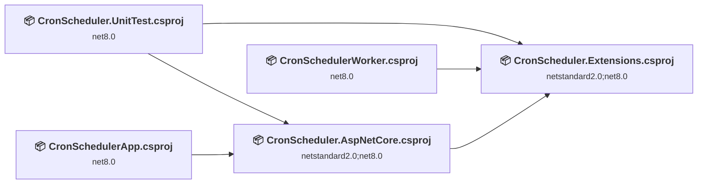
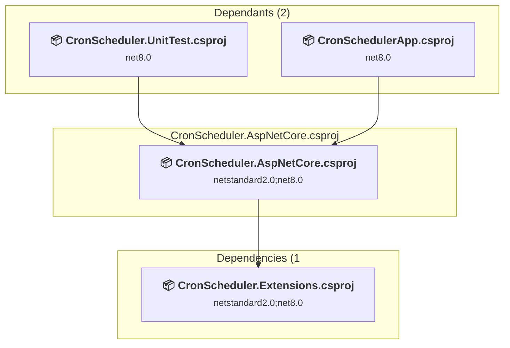
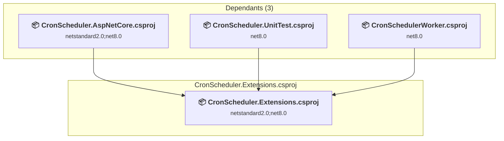
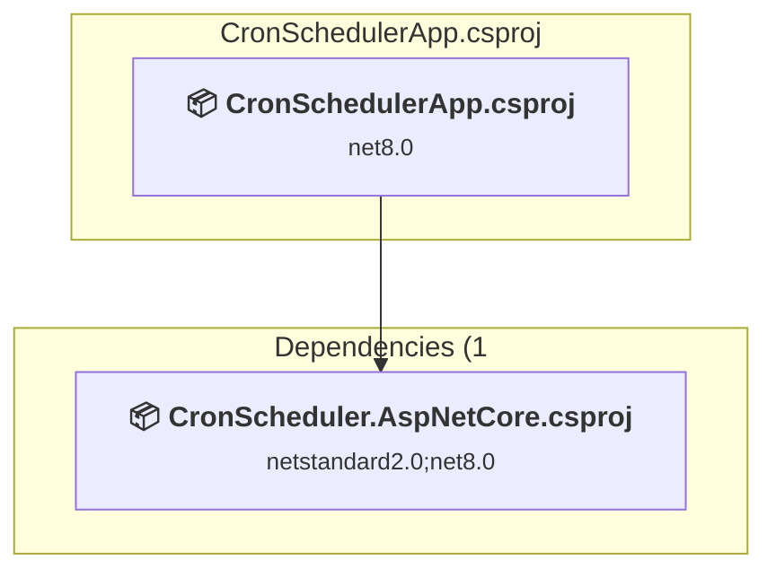
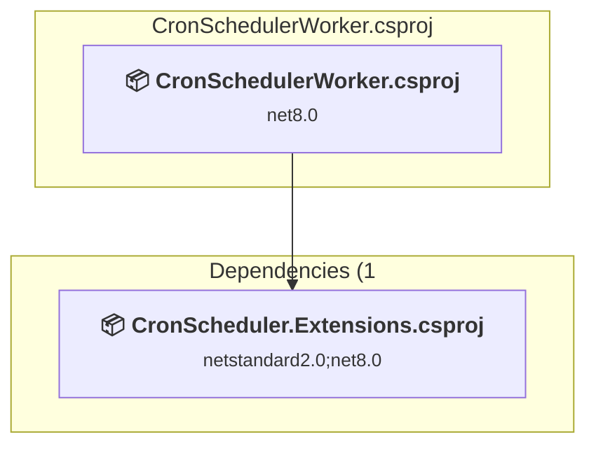
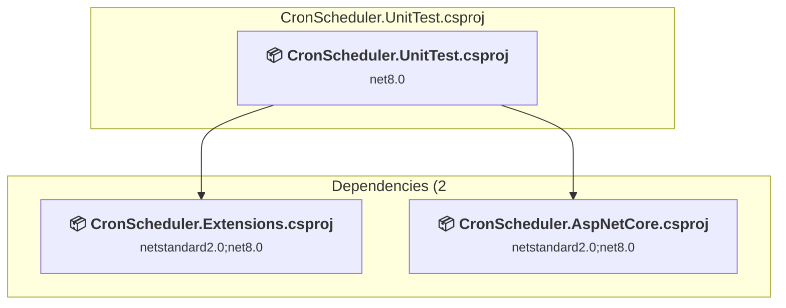

# Projects and dependencies analysis

This document provides a comprehensive overview of the projects and their dependencies in the context of upgrading to .NETCoreApp,Version=v10.0.

## Table of Contents

- [Executive Summary](#executive-Summary)
  - [Highlevel Metrics](#highlevel-metrics)
  - [Projects Compatibility](#projects-compatibility)
  - [Package Compatibility](#package-compatibility)
  - [API Compatibility](#api-compatibility)
  - [Binding Redirect Configuration](#binding-redirect-configuration)
- [Aggregate NuGet packages details](#aggregate-nuget-packages-details)
- [Top API Migration Challenges](#top-api-migration-challenges)
  - [Technologies and Features](#technologies-and-features)
  - [Most Frequent API Issues](#most-frequent-api-issues)
- [Projects Relationship Graph](#projects-relationship-graph)
- [Project Details](#project-details)

  - [src\CronScheduler.AspNetCore\CronScheduler.AspNetCore.csproj](#srccronscheduleraspnetcorecronscheduleraspnetcorecsproj)
  - [src\CronScheduler.Extensions\CronScheduler.Extensions.csproj](#srccronschedulerextensionscronschedulerextensionscsproj)
  - [src\CronSchedulerApp\CronSchedulerApp.csproj](#srccronschedulerappcronschedulerappcsproj)
  - [src\CronSchedulerWorker\CronSchedulerWorker.csproj](#srccronschedulerworkercronschedulerworkercsproj)
  - [test\CronScheduler.UnitTest\CronScheduler.UnitTest.csproj](#testcronschedulerunittestcronschedulerunittestcsproj)

## Executive Summary

### Highlevel Metrics

| Metric | Count | Status |
| :--- | :---: | :--- |
| Total Projects | 5 | All require upgrade |
| Total NuGet Packages | 164 | 17 need upgrade |
| Total Code Files | 67 |  |
| Total Code Files with Incidents | 19 |  |
| Total Lines of Code | 3820 |  |
| Total Number of Issues | 75 |  |
| Estimated LOC to modify | 50+ | at least 1,3% of codebase |

### Projects Compatibility

| Project | Target Framework | Difficulty | Package Issues | API Issues | Binding Issues | Est. LOC Impact | Description |
| :--- | :---: | :---: | :---: | :---: | :---: | :---: | :--- |
| [src\CronScheduler.AspNetCore\CronScheduler.AspNetCore.csproj](#srccronscheduleraspnetcorecronscheduleraspnetcorecsproj) | netstandard2.0;net8.0 | 🟢 Low | 1 | 1 | 0 | 1+ | ClassLibrary, Sdk Style = True |
| [src\CronScheduler.Extensions\CronScheduler.Extensions.csproj](#srccronschedulerextensionscronschedulerextensionscsproj) | netstandard2.0;net8.0 | 🟢 Low | 5 | 2 | 0 | 2+ | ClassLibrary, Sdk Style = True |
| [src\CronSchedulerApp\CronSchedulerApp.csproj](#srccronschedulerappcronschedulerappcsproj) | net8.0 | 🟢 Low | 10 | 18 | 0 | 18+ | AspNetCore, Sdk Style = True |
| [src\CronSchedulerWorker\CronSchedulerWorker.csproj](#srccronschedulerworkercronschedulerworkercsproj) | net8.0 | 🟢 Low | 2 | 1 | 0 | 1+ | DotNetCoreApp, Sdk Style = True |
| [test\CronScheduler.UnitTest\CronScheduler.UnitTest.csproj](#testcronschedulerunittestcronschedulerunittestcsproj) | net8.0 | 🟢 Low | 2 | 28 | 0 | 28+ | DotNetCoreApp, Sdk Style = True |

### Package Compatibility

| Status | Count | Percentage |
| :--- | :---: | :---: |
| ✅ Compatible | 147 | 89,6% |
| ⚠️ Incompatible | 2 | 1,2% |
| 🔄 Upgrade Recommended | 15 | 9,1% |
| ***Total NuGet Packages*** | ***164*** | ***100%*** |

### API Compatibility

| Category | Count | Impact |
| :--- | :---: | :--- |
| 🔴 Binary Incompatible | 0 | High - Require code changes |
| 🟡 Source Incompatible | 33 | Medium - Needs re-compilation and potential conflicting API error fixing |
| 🔵 Behavioral change | 17 | Low - Behavioral changes that may require testing at runtime |
| ✅ Compatible | 6187 |  |
| ***Total APIs Analyzed*** | ***6237*** |  |

## Aggregate NuGet packages details

| Package | Current Version | Suggested Version | Projects | Description |
| :--- | :---: | :---: | :--- | :--- |
| Azure.Core | 1.41.0 |  | [CronSchedulerApp.csproj](#srccronschedulerappcronschedulerappcsproj) | ✅Compatible |
| Azure.Identity | 1.12.1 |  | [CronSchedulerApp.csproj](#srccronschedulerappcronschedulerappcsproj) | ✅Compatible |
| Bet.Extensions | 4.0.1 |  | [CronScheduler.AspNetCore.csproj](#srccronscheduleraspnetcorecronscheduleraspnetcorecsproj) [CronScheduler.Extensions.csproj](#srccronschedulerextensionscronschedulerextensionscsproj) [CronScheduler.UnitTest.csproj](#testcronschedulerunittestcronschedulerunittestcsproj) [CronSchedulerApp.csproj](#srccronschedulerappcronschedulerappcsproj) [CronSchedulerWorker.csproj](#srccronschedulerworkercronschedulerworkercsproj) | ✅Compatible |
| Bet.Extensions.Options | 4.0.1 |  | [CronScheduler.AspNetCore.csproj](#srccronscheduleraspnetcorecronscheduleraspnetcorecsproj) [CronScheduler.Extensions.csproj](#srccronschedulerextensionscronschedulerextensionscsproj) [CronScheduler.UnitTest.csproj](#testcronschedulerunittestcronschedulerunittestcsproj) [CronSchedulerApp.csproj](#srccronschedulerappcronschedulerappcsproj) [CronSchedulerWorker.csproj](#srccronschedulerworkercronschedulerworkercsproj) | ✅Compatible |
| Bet.Extensions.Testing | 4.0.1 |  | [CronScheduler.UnitTest.csproj](#testcronschedulerunittestcronschedulerunittestcsproj) | ✅Compatible |
| Castle.Core | 5.1.1 |  | [CronScheduler.UnitTest.csproj](#testcronschedulerunittestcronschedulerunittestcsproj) | ✅Compatible |
| Cronos | 0.8.4 |  | [CronScheduler.AspNetCore.csproj](#srccronscheduleraspnetcorecronscheduleraspnetcorecsproj) [CronScheduler.Extensions.csproj](#srccronschedulerextensionscronschedulerextensionscsproj) [CronScheduler.UnitTest.csproj](#testcronschedulerunittestcronschedulerunittestcsproj) [CronSchedulerApp.csproj](#srccronschedulerappcronschedulerappcsproj) [CronSchedulerWorker.csproj](#srccronschedulerworkercronschedulerworkercsproj) | ✅Compatible |
| Humanizer.Core | 2.14.1 |  | [CronSchedulerApp.csproj](#srccronschedulerappcronschedulerappcsproj) | ✅Compatible |
| Microsoft.AspNetCore.Cryptography.Internal | 8.0.30 |  | [CronSchedulerApp.csproj](#srccronschedulerappcronschedulerappcsproj) | ✅Compatible |
| Microsoft.AspNetCore.Cryptography.KeyDerivation | 8.0.30 |  | [CronSchedulerApp.csproj](#srccronschedulerappcronschedulerappcsproj) | ✅Compatible |
| Microsoft.AspNetCore.Diagnostics.EntityFrameworkCore | 8.0.30 | 10.0.11 | [CronSchedulerApp.csproj](#srccronschedulerappcronschedulerappcsproj) | NuGet package upgrade is recommended |
| Microsoft.AspNetCore.Hosting.Abstractions | 2.3.12 |  | [CronScheduler.AspNetCore.csproj](#srccronscheduleraspnetcorecronscheduleraspnetcorecsproj) | ✅Compatible |
| Microsoft.AspNetCore.Hosting.Server.Abstractions | 2.3.11 |  | [CronScheduler.AspNetCore.csproj](#srccronscheduleraspnetcorecronscheduleraspnetcorecsproj) | ✅Compatible |
| Microsoft.AspNetCore.Http.Abstractions | 2.3.11 |  | [CronScheduler.AspNetCore.csproj](#srccronscheduleraspnetcorecronscheduleraspnetcorecsproj) | ✅Compatible |
| Microsoft.AspNetCore.Http.Features | 2.3.10 |  | [CronScheduler.AspNetCore.csproj](#srccronscheduleraspnetcorecronscheduleraspnetcorecsproj) | ✅Compatible |
| Microsoft.AspNetCore.Identity.EntityFrameworkCore | 8.0.30 | 10.0.11 | [CronSchedulerApp.csproj](#srccronschedulerappcronschedulerappcsproj) | NuGet package upgrade is recommended |
| Microsoft.AspNetCore.Identity.UI | 8.0.30 | 10.0.11 | [CronSchedulerApp.csproj](#srccronschedulerappcronschedulerappcsproj) | NuGet package upgrade is recommended |
| Microsoft.AspNetCore.JsonPatch | 8.0.30 |  | [CronSchedulerApp.csproj](#srccronschedulerappcronschedulerappcsproj) | ✅Compatible |
| Microsoft.AspNetCore.Mvc.NewtonsoftJson | 8.0.30 | 10.0.11 | [CronSchedulerApp.csproj](#srccronschedulerappcronschedulerappcsproj) | NuGet package upgrade is recommended |
| Microsoft.AspNetCore.TestHost | 8.0.30 | 10.0.11 | [CronScheduler.UnitTest.csproj](#testcronschedulerunittestcronschedulerunittestcsproj) | NuGet package upgrade is recommended |
| Microsoft.Bcl.AsyncInterfaces | 6.0.0 |  | [CronSchedulerApp.csproj](#srccronschedulerappcronschedulerappcsproj) | ✅Compatible |
| Microsoft.Bcl.AsyncInterfaces | 8.0.0 |  | [CronScheduler.AspNetCore.csproj](#srccronscheduleraspnetcorecronscheduleraspnetcorecsproj) [CronScheduler.Extensions.csproj](#srccronschedulerextensionscronschedulerextensionscsproj) | ✅Compatible |
| Microsoft.Build.Tasks.Git | 1.1.1 |  | [CronScheduler.AspNetCore.csproj](#srccronscheduleraspnetcorecronscheduleraspnetcorecsproj) [CronScheduler.Extensions.csproj](#srccronschedulerextensionscronschedulerextensionscsproj) [CronScheduler.UnitTest.csproj](#testcronschedulerunittestcronschedulerunittestcsproj) [CronSchedulerApp.csproj](#srccronschedulerappcronschedulerappcsproj) [CronSchedulerWorker.csproj](#srccronschedulerworkercronschedulerworkercsproj) | ✅Compatible |
| Microsoft.CodeAnalysis.Analyzers | 3.3.3 |  | [CronSchedulerApp.csproj](#srccronschedulerappcronschedulerappcsproj) | ✅Compatible |
| Microsoft.CodeAnalysis.Common | 4.5.0 |  | [CronSchedulerApp.csproj](#srccronschedulerappcronschedulerappcsproj) | ✅Compatible |
| Microsoft.CodeAnalysis.CSharp | 4.5.0 |  | [CronSchedulerApp.csproj](#srccronschedulerappcronschedulerappcsproj) | ✅Compatible |
| Microsoft.CodeAnalysis.CSharp.Workspaces | 4.5.0 |  | [CronSchedulerApp.csproj](#srccronschedulerappcronschedulerappcsproj) | ✅Compatible |
| Microsoft.CodeAnalysis.Workspaces.Common | 4.5.0 |  | [CronSchedulerApp.csproj](#srccronschedulerappcronschedulerappcsproj) | ✅Compatible |
| Microsoft.CodeCoverage | 17.14.1 |  | [CronScheduler.UnitTest.csproj](#testcronschedulerunittestcronschedulerunittestcsproj) | ✅Compatible |
| Microsoft.CSharp | 4.7.0 |  | [CronSchedulerApp.csproj](#srccronschedulerappcronschedulerappcsproj) | ✅Compatible |
| Microsoft.Data.SqlClient | 5.1.9 |  | [CronSchedulerApp.csproj](#srccronschedulerappcronschedulerappcsproj) | ✅Compatible |
| Microsoft.Data.SqlClient.SNI.runtime | 5.1.2 |  | [CronSchedulerApp.csproj](#srccronschedulerappcronschedulerappcsproj) | ✅Compatible |
| Microsoft.Data.Sqlite.Core | 8.0.30 |  | [CronSchedulerApp.csproj](#srccronschedulerappcronschedulerappcsproj) | ✅Compatible |
| Microsoft.EntityFrameworkCore | 8.0.30 |  | [CronSchedulerApp.csproj](#srccronschedulerappcronschedulerappcsproj) | ✅Compatible |
| Microsoft.EntityFrameworkCore.Abstractions | 8.0.30 |  | [CronSchedulerApp.csproj](#srccronschedulerappcronschedulerappcsproj) | ✅Compatible |
| Microsoft.EntityFrameworkCore.Analyzers | 8.0.30 |  | [CronSchedulerApp.csproj](#srccronschedulerappcronschedulerappcsproj) | ✅Compatible |
| Microsoft.EntityFrameworkCore.Design | 8.0.30 |  | [CronSchedulerApp.csproj](#srccronschedulerappcronschedulerappcsproj) | ✅Compatible |
| Microsoft.EntityFrameworkCore.Relational | 8.0.30 | 10.0.11 | [CronSchedulerApp.csproj](#srccronschedulerappcronschedulerappcsproj) | NuGet package upgrade is recommended |
| Microsoft.EntityFrameworkCore.Sqlite | 8.0.30 | 10.0.11 | [CronSchedulerApp.csproj](#srccronschedulerappcronschedulerappcsproj) | NuGet package upgrade is recommended |
| Microsoft.EntityFrameworkCore.Sqlite.Core | 8.0.30 |  | [CronSchedulerApp.csproj](#srccronschedulerappcronschedulerappcsproj) | ✅Compatible |
| Microsoft.EntityFrameworkCore.SqlServer | 8.0.30 | 10.0.11 | [CronSchedulerApp.csproj](#srccronschedulerappcronschedulerappcsproj) | NuGet package upgrade is recommended |
| Microsoft.EntityFrameworkCore.Tools | 8.0.30 | 10.0.11 | [CronSchedulerApp.csproj](#srccronschedulerappcronschedulerappcsproj) | NuGet package upgrade is recommended |
| Microsoft.Extensions.Caching.Abstractions | 8.0.0 |  | [CronSchedulerApp.csproj](#srccronschedulerappcronschedulerappcsproj) | ✅Compatible |
| Microsoft.Extensions.Caching.Memory | 8.0.1 |  | [CronSchedulerApp.csproj](#srccronschedulerappcronschedulerappcsproj) | ✅Compatible |
| Microsoft.Extensions.Configuration | 8.0.0 |  | [CronSchedulerApp.csproj](#srccronschedulerappcronschedulerappcsproj) [CronSchedulerWorker.csproj](#srccronschedulerworkercronschedulerworkercsproj) | ✅Compatible |
| Microsoft.Extensions.Configuration.Abstractions | 8.0.0 |  | [CronScheduler.AspNetCore.csproj](#srccronscheduleraspnetcorecronscheduleraspnetcorecsproj) [CronScheduler.Extensions.csproj](#srccronschedulerextensionscronschedulerextensionscsproj) [CronScheduler.UnitTest.csproj](#testcronschedulerunittestcronschedulerunittestcsproj) [CronSchedulerApp.csproj](#srccronschedulerappcronschedulerappcsproj) [CronSchedulerWorker.csproj](#srccronschedulerworkercronschedulerworkercsproj) | ✅Compatible |
| Microsoft.Extensions.Configuration.Binder | 8.0.0 |  | [CronScheduler.AspNetCore.csproj](#srccronscheduleraspnetcorecronscheduleraspnetcorecsproj) [CronScheduler.Extensions.csproj](#srccronschedulerextensionscronschedulerextensionscsproj) [CronScheduler.UnitTest.csproj](#testcronschedulerunittestcronschedulerunittestcsproj) [CronSchedulerApp.csproj](#srccronschedulerappcronschedulerappcsproj) | ✅Compatible |
| Microsoft.Extensions.Configuration.Binder | 8.0.2 |  | [CronSchedulerWorker.csproj](#srccronschedulerworkercronschedulerworkercsproj) | ✅Compatible |
| Microsoft.Extensions.Configuration.CommandLine | 8.0.0 |  | [CronSchedulerWorker.csproj](#srccronschedulerworkercronschedulerworkercsproj) | ✅Compatible |
| Microsoft.Extensions.Configuration.EnvironmentVariables | 8.0.0 |  | [CronSchedulerWorker.csproj](#srccronschedulerworkercronschedulerworkercsproj) | ✅Compatible |
| Microsoft.Extensions.Configuration.FileExtensions | 8.0.1 |  | [CronSchedulerWorker.csproj](#srccronschedulerworkercronschedulerworkercsproj) | ✅Compatible |
| Microsoft.Extensions.Configuration.Json | 8.0.1 |  | [CronSchedulerWorker.csproj](#srccronschedulerworkercronschedulerworkercsproj) | ✅Compatible |
| Microsoft.Extensions.Configuration.UserSecrets | 8.0.1 |  | [CronSchedulerWorker.csproj](#srccronschedulerworkercronschedulerworkercsproj) | ✅Compatible |
| Microsoft.Extensions.DependencyInjection | 8.0.1 | 10.0.11 | [CronScheduler.AspNetCore.csproj](#srccronscheduleraspnetcorecronscheduleraspnetcorecsproj) [CronScheduler.Extensions.csproj](#srccronschedulerextensionscronschedulerextensionscsproj) [CronScheduler.UnitTest.csproj](#testcronschedulerunittestcronschedulerunittestcsproj) [CronSchedulerApp.csproj](#srccronschedulerappcronschedulerappcsproj) [CronSchedulerWorker.csproj](#srccronschedulerworkercronschedulerworkercsproj) | NuGet package upgrade is recommended |
| Microsoft.Extensions.DependencyInjection.Abstractions | 8.0.2 |  | [CronScheduler.AspNetCore.csproj](#srccronscheduleraspnetcorecronscheduleraspnetcorecsproj) [CronScheduler.Extensions.csproj](#srccronschedulerextensionscronschedulerextensionscsproj) [CronScheduler.UnitTest.csproj](#testcronschedulerunittestcronschedulerunittestcsproj) [CronSchedulerApp.csproj](#srccronschedulerappcronschedulerappcsproj) [CronSchedulerWorker.csproj](#srccronschedulerworkercronschedulerworkercsproj) | ✅Compatible |
| Microsoft.Extensions.DependencyModel | 8.0.2 |  | [CronSchedulerApp.csproj](#srccronschedulerappcronschedulerappcsproj) | ✅Compatible |
| Microsoft.Extensions.Diagnostics | 8.0.1 |  | [CronSchedulerApp.csproj](#srccronschedulerappcronschedulerappcsproj) [CronSchedulerWorker.csproj](#srccronschedulerworkercronschedulerworkercsproj) | ✅Compatible |
| Microsoft.Extensions.Diagnostics.Abstractions | 8.0.1 |  | [CronScheduler.AspNetCore.csproj](#srccronscheduleraspnetcorecronscheduleraspnetcorecsproj) [CronScheduler.Extensions.csproj](#srccronschedulerextensionscronschedulerextensionscsproj) [CronScheduler.UnitTest.csproj](#testcronschedulerunittestcronschedulerunittestcsproj) [CronSchedulerApp.csproj](#srccronschedulerappcronschedulerappcsproj) [CronSchedulerWorker.csproj](#srccronschedulerworkercronschedulerworkercsproj) | ✅Compatible |
| Microsoft.Extensions.FileProviders.Abstractions | 8.0.0 |  | [CronScheduler.AspNetCore.csproj](#srccronscheduleraspnetcorecronscheduleraspnetcorecsproj) [CronScheduler.Extensions.csproj](#srccronschedulerextensionscronschedulerextensionscsproj) [CronScheduler.UnitTest.csproj](#testcronschedulerunittestcronschedulerunittestcsproj) [CronSchedulerApp.csproj](#srccronschedulerappcronschedulerappcsproj) [CronSchedulerWorker.csproj](#srccronschedulerworkercronschedulerworkercsproj) | ✅Compatible |
| Microsoft.Extensions.FileProviders.Embedded | 8.0.30 |  | [CronSchedulerApp.csproj](#srccronschedulerappcronschedulerappcsproj) | ✅Compatible |
| Microsoft.Extensions.FileProviders.Physical | 8.0.0 |  | [CronSchedulerWorker.csproj](#srccronschedulerworkercronschedulerworkercsproj) | ✅Compatible |
| Microsoft.Extensions.FileSystemGlobbing | 8.0.0 |  | [CronSchedulerWorker.csproj](#srccronschedulerworkercronschedulerworkercsproj) | ✅Compatible |
| Microsoft.Extensions.Hosting | 8.0.1 | 10.0.11 | [CronSchedulerWorker.csproj](#srccronschedulerworkercronschedulerworkercsproj) | NuGet package upgrade is recommended |
| Microsoft.Extensions.Hosting.Abstractions | 8.0.1 | 10.0.11 | [CronScheduler.AspNetCore.csproj](#srccronscheduleraspnetcorecronscheduleraspnetcorecsproj) [CronScheduler.Extensions.csproj](#srccronschedulerextensionscronschedulerextensionscsproj) [CronScheduler.UnitTest.csproj](#testcronschedulerunittestcronschedulerunittestcsproj) [CronSchedulerApp.csproj](#srccronschedulerappcronschedulerappcsproj) [CronSchedulerWorker.csproj](#srccronschedulerworkercronschedulerworkercsproj) | NuGet package upgrade is recommended |
| Microsoft.Extensions.Http | 8.0.1 |  | [CronSchedulerApp.csproj](#srccronschedulerappcronschedulerappcsproj) | ✅Compatible |
| Microsoft.Extensions.Http.Polly | 8.0.30 | 10.0.11 | [CronSchedulerApp.csproj](#srccronschedulerappcronschedulerappcsproj) | NuGet package upgrade is recommended |
| Microsoft.Extensions.Identity.Core | 8.0.30 |  | [CronSchedulerApp.csproj](#srccronschedulerappcronschedulerappcsproj) | ✅Compatible |
| Microsoft.Extensions.Identity.Stores | 8.0.30 |  | [CronSchedulerApp.csproj](#srccronschedulerappcronschedulerappcsproj) | ✅Compatible |
| Microsoft.Extensions.Logging | 6.0.0 |  | [CronScheduler.UnitTest.csproj](#testcronschedulerunittestcronschedulerunittestcsproj) | ✅Compatible |
| Microsoft.Extensions.Logging | 8.0.1 |  | [CronSchedulerApp.csproj](#srccronschedulerappcronschedulerappcsproj) [CronSchedulerWorker.csproj](#srccronschedulerworkercronschedulerworkercsproj) | ✅Compatible |
| Microsoft.Extensions.Logging.Abstractions | 8.0.3 | 10.0.11 | [CronScheduler.AspNetCore.csproj](#srccronscheduleraspnetcorecronscheduleraspnetcorecsproj) [CronScheduler.Extensions.csproj](#srccronschedulerextensionscronschedulerextensionscsproj) [CronScheduler.UnitTest.csproj](#testcronschedulerunittestcronschedulerunittestcsproj) [CronSchedulerApp.csproj](#srccronschedulerappcronschedulerappcsproj) [CronSchedulerWorker.csproj](#srccronschedulerworkercronschedulerworkercsproj) | NuGet package upgrade is recommended |
| Microsoft.Extensions.Logging.Configuration | 8.0.1 |  | [CronSchedulerWorker.csproj](#srccronschedulerworkercronschedulerworkercsproj) | ✅Compatible |
| Microsoft.Extensions.Logging.Console | 8.0.1 |  | [CronSchedulerWorker.csproj](#srccronschedulerworkercronschedulerworkercsproj) | ✅Compatible |
| Microsoft.Extensions.Logging.Debug | 8.0.1 |  | [CronSchedulerWorker.csproj](#srccronschedulerworkercronschedulerworkercsproj) | ✅Compatible |
| Microsoft.Extensions.Logging.EventLog | 8.0.1 |  | [CronSchedulerWorker.csproj](#srccronschedulerworkercronschedulerworkercsproj) | ✅Compatible |
| Microsoft.Extensions.Logging.EventSource | 8.0.1 |  | [CronSchedulerWorker.csproj](#srccronschedulerworkercronschedulerworkercsproj) | ✅Compatible |
| Microsoft.Extensions.Options | 8.0.2 |  | [CronScheduler.AspNetCore.csproj](#srccronscheduleraspnetcorecronscheduleraspnetcorecsproj) [CronScheduler.Extensions.csproj](#srccronschedulerextensionscronschedulerextensionscsproj) [CronScheduler.UnitTest.csproj](#testcronschedulerunittestcronschedulerunittestcsproj) [CronSchedulerApp.csproj](#srccronschedulerappcronschedulerappcsproj) [CronSchedulerWorker.csproj](#srccronschedulerworkercronschedulerworkercsproj) | ✅Compatible |
| Microsoft.Extensions.Options.ConfigurationExtensions | 8.0.0 | 10.0.11 | [CronScheduler.AspNetCore.csproj](#srccronscheduleraspnetcorecronscheduleraspnetcorecsproj) [CronScheduler.Extensions.csproj](#srccronschedulerextensionscronschedulerextensionscsproj) [CronScheduler.UnitTest.csproj](#testcronschedulerunittestcronschedulerunittestcsproj) [CronSchedulerApp.csproj](#srccronschedulerappcronschedulerappcsproj) [CronSchedulerWorker.csproj](#srccronschedulerworkercronschedulerworkercsproj) | NuGet package upgrade is recommended |
| Microsoft.Extensions.Options.DataAnnotations | 3.1.21 |  | [CronScheduler.AspNetCore.csproj](#srccronscheduleraspnetcorecronscheduleraspnetcorecsproj) [CronScheduler.Extensions.csproj](#srccronschedulerextensionscronschedulerextensionscsproj) [CronScheduler.UnitTest.csproj](#testcronschedulerunittestcronschedulerunittestcsproj) [CronSchedulerApp.csproj](#srccronschedulerappcronschedulerappcsproj) [CronSchedulerWorker.csproj](#srccronschedulerworkercronschedulerworkercsproj) | ✅Compatible |
| Microsoft.Extensions.Primitives | 8.0.0 |  | [CronScheduler.AspNetCore.csproj](#srccronscheduleraspnetcorecronscheduleraspnetcorecsproj) [CronScheduler.Extensions.csproj](#srccronschedulerextensionscronschedulerextensionscsproj) [CronScheduler.UnitTest.csproj](#testcronschedulerunittestcronschedulerunittestcsproj) [CronSchedulerApp.csproj](#srccronschedulerappcronschedulerappcsproj) [CronSchedulerWorker.csproj](#srccronschedulerworkercronschedulerworkercsproj) | ✅Compatible |
| Microsoft.Identity.Client | 4.76.0 |  | [CronSchedulerApp.csproj](#srccronschedulerappcronschedulerappcsproj) | ✅Compatible |
| Microsoft.Identity.Client.Extensions.Msal | 4.65.0 |  | [CronSchedulerApp.csproj](#srccronschedulerappcronschedulerappcsproj) | ✅Compatible |
| Microsoft.IdentityModel.Abstractions | 6.35.0 |  | [CronSchedulerApp.csproj](#srccronschedulerappcronschedulerappcsproj) | ✅Compatible |
| Microsoft.IdentityModel.JsonWebTokens | 6.35.0 |  | [CronSchedulerApp.csproj](#srccronschedulerappcronschedulerappcsproj) | ✅Compatible |
| Microsoft.IdentityModel.Logging | 6.35.0 |  | [CronSchedulerApp.csproj](#srccronschedulerappcronschedulerappcsproj) | ✅Compatible |
| Microsoft.IdentityModel.Protocols | 6.35.0 |  | [CronSchedulerApp.csproj](#srccronschedulerappcronschedulerappcsproj) | ✅Compatible |
| Microsoft.IdentityModel.Protocols.OpenIdConnect | 6.35.0 |  | [CronSchedulerApp.csproj](#srccronschedulerappcronschedulerappcsproj) | ✅Compatible |
| Microsoft.IdentityModel.Tokens | 6.35.0 |  | [CronSchedulerApp.csproj](#srccronschedulerappcronschedulerappcsproj) | ✅Compatible |
| Microsoft.NET.Test.Sdk | 17.14.1 |  | [CronScheduler.UnitTest.csproj](#testcronschedulerunittestcronschedulerunittestcsproj) | ✅Compatible |
| Microsoft.NETCore.Platforms | 1.1.0 |  | [CronScheduler.AspNetCore.csproj](#srccronscheduleraspnetcorecronscheduleraspnetcorecsproj) [CronScheduler.Extensions.csproj](#srccronschedulerextensionscronschedulerextensionscsproj) [CronSchedulerApp.csproj](#srccronschedulerappcronschedulerappcsproj) | ✅Compatible |
| Microsoft.NETCore.Targets | 1.1.0 |  | [CronSchedulerApp.csproj](#srccronschedulerappcronschedulerappcsproj) | ✅Compatible |
| Microsoft.SourceLink.Common | 1.1.1 |  | [CronScheduler.AspNetCore.csproj](#srccronscheduleraspnetcorecronscheduleraspnetcorecsproj) [CronScheduler.Extensions.csproj](#srccronschedulerextensionscronschedulerextensionscsproj) [CronScheduler.UnitTest.csproj](#testcronschedulerunittestcronschedulerunittestcsproj) [CronSchedulerApp.csproj](#srccronschedulerappcronschedulerappcsproj) [CronSchedulerWorker.csproj](#srccronschedulerworkercronschedulerworkercsproj) | ✅Compatible |
| Microsoft.SourceLink.GitHub | 1.1.1 |  | [CronScheduler.AspNetCore.csproj](#srccronscheduleraspnetcorecronscheduleraspnetcorecsproj) [CronScheduler.Extensions.csproj](#srccronschedulerextensionscronschedulerextensionscsproj) [CronScheduler.UnitTest.csproj](#testcronschedulerunittestcronschedulerunittestcsproj) [CronSchedulerApp.csproj](#srccronschedulerappcronschedulerappcsproj) [CronSchedulerWorker.csproj](#srccronschedulerworkercronschedulerworkercsproj) | ✅Compatible |
| Microsoft.SqlServer.Server | 1.0.0 |  | [CronSchedulerApp.csproj](#srccronschedulerappcronschedulerappcsproj) | ✅Compatible |
| Microsoft.TestPlatform.ObjectModel | 17.14.1 |  | [CronScheduler.UnitTest.csproj](#testcronschedulerunittestcronschedulerunittestcsproj) | ✅Compatible |
| Microsoft.TestPlatform.TestHost | 17.14.1 |  | [CronScheduler.UnitTest.csproj](#testcronschedulerunittestcronschedulerunittestcsproj) | ✅Compatible |
| Microsoft.VisualStudio.Azure.Containers.Tools.Targets | 1.23.0 |  | [CronSchedulerApp.csproj](#srccronschedulerappcronschedulerappcsproj) [CronSchedulerWorker.csproj](#srccronschedulerworkercronschedulerworkercsproj) | ⚠️NuGet package is incompatible |
| Microsoft.Win32.SystemEvents | 6.0.0 |  | [CronSchedulerApp.csproj](#srccronschedulerappcronschedulerappcsproj) | ✅Compatible |
| Mono.TextTemplating | 2.2.1 |  | [CronSchedulerApp.csproj](#srccronschedulerappcronschedulerappcsproj) | ✅Compatible |
| Moq | 4.20.72 |  | [CronScheduler.UnitTest.csproj](#testcronschedulerunittestcronschedulerunittestcsproj) | ✅Compatible |
| NETStandard.Library | 2.0.3 |  | [CronScheduler.AspNetCore.csproj](#srccronscheduleraspnetcorecronscheduleraspnetcorecsproj) [CronScheduler.Extensions.csproj](#srccronschedulerextensionscronschedulerextensionscsproj) | NuGet package functionality is included with framework reference |
| Newtonsoft.Json | 13.0.3 |  | [CronScheduler.UnitTest.csproj](#testcronschedulerunittestcronschedulerunittestcsproj) [CronSchedulerApp.csproj](#srccronschedulerappcronschedulerappcsproj) | ✅Compatible |
| Newtonsoft.Json.Bson | 1.0.2 |  | [CronSchedulerApp.csproj](#srccronschedulerappcronschedulerappcsproj) | ✅Compatible |
| Polly | 7.2.4 |  | [CronSchedulerApp.csproj](#srccronschedulerappcronschedulerappcsproj) | ✅Compatible |
| Polly.Extensions.Http | 3.0.0 |  | [CronSchedulerApp.csproj](#srccronschedulerappcronschedulerappcsproj) | ✅Compatible |
| SQLitePCLRaw.bundle_e_sqlite3 | 2.1.12 |  | [CronSchedulerApp.csproj](#srccronschedulerappcronschedulerappcsproj) | ✅Compatible |
| SQLitePCLRaw.core | 2.1.12 |  | [CronSchedulerApp.csproj](#srccronschedulerappcronschedulerappcsproj) | ✅Compatible |
| SQLitePCLRaw.lib.e_sqlite3 | 2.1.12 |  | [CronSchedulerApp.csproj](#srccronschedulerappcronschedulerappcsproj) | ✅Compatible |
| SQLitePCLRaw.provider.e_sqlite3 | 2.1.12 |  | [CronSchedulerApp.csproj](#srccronschedulerappcronschedulerappcsproj) | ✅Compatible |
| System.Buffers | 4.5.1 |  | [CronScheduler.AspNetCore.csproj](#srccronscheduleraspnetcorecronscheduleraspnetcorecsproj) [CronScheduler.Extensions.csproj](#srccronschedulerextensionscronschedulerextensionscsproj) | ✅Compatible |
| System.ClientModel | 1.0.0 |  | [CronSchedulerApp.csproj](#srccronschedulerappcronschedulerappcsproj) | ✅Compatible |
| System.CodeDom | 4.4.0 |  | [CronSchedulerApp.csproj](#srccronschedulerappcronschedulerappcsproj) | ✅Compatible |
| System.Collections.Immutable | 6.0.0 |  | [CronSchedulerApp.csproj](#srccronschedulerappcronschedulerappcsproj) | ✅Compatible |
| System.Collections.Immutable | 8.0.0 |  | [CronScheduler.UnitTest.csproj](#testcronschedulerunittestcronschedulerunittestcsproj) | ✅Compatible |
| System.ComponentModel.Annotations | 5.0.0 |  | [CronScheduler.AspNetCore.csproj](#srccronscheduleraspnetcorecronscheduleraspnetcorecsproj) [CronScheduler.Extensions.csproj](#srccronschedulerextensionscronschedulerextensionscsproj) | ✅Compatible |
| System.Composition | 6.0.0 |  | [CronSchedulerApp.csproj](#srccronschedulerappcronschedulerappcsproj) | ✅Compatible |
| System.Composition.AttributedModel | 6.0.0 |  | [CronSchedulerApp.csproj](#srccronschedulerappcronschedulerappcsproj) | ✅Compatible |
| System.Composition.Convention | 6.0.0 |  | [CronSchedulerApp.csproj](#srccronschedulerappcronschedulerappcsproj) | ✅Compatible |
| System.Composition.Hosting | 6.0.0 |  | [CronSchedulerApp.csproj](#srccronschedulerappcronschedulerappcsproj) | ✅Compatible |
| System.Composition.Runtime | 6.0.0 |  | [CronSchedulerApp.csproj](#srccronschedulerappcronschedulerappcsproj) | ✅Compatible |
| System.Composition.TypedParts | 6.0.0 |  | [CronSchedulerApp.csproj](#srccronschedulerappcronschedulerappcsproj) | ✅Compatible |
| System.Configuration.ConfigurationManager | 6.0.1 |  | [CronSchedulerApp.csproj](#srccronschedulerappcronschedulerappcsproj) | ✅Compatible |
| System.Diagnostics.DiagnosticSource | 6.0.0 |  | [CronScheduler.UnitTest.csproj](#testcronschedulerunittestcronschedulerunittestcsproj) | ✅Compatible |
| System.Diagnostics.DiagnosticSource | 6.0.1 |  | [CronSchedulerApp.csproj](#srccronschedulerappcronschedulerappcsproj) | ✅Compatible |
| System.Diagnostics.DiagnosticSource | 8.0.1 |  | [CronScheduler.AspNetCore.csproj](#srccronscheduleraspnetcorecronscheduleraspnetcorecsproj) [CronScheduler.Extensions.csproj](#srccronschedulerextensionscronschedulerextensionscsproj) | ✅Compatible |
| System.Diagnostics.EventLog | 6.0.0 |  | [CronScheduler.UnitTest.csproj](#testcronschedulerunittestcronschedulerunittestcsproj) | ✅Compatible |
| System.Diagnostics.EventLog | 8.0.1 |  | [CronSchedulerWorker.csproj](#srccronschedulerworkercronschedulerworkercsproj) | ✅Compatible |
| System.Drawing.Common | 6.0.0 |  | [CronSchedulerApp.csproj](#srccronschedulerappcronschedulerappcsproj) | ✅Compatible |
| System.Formats.Asn1 | 8.0.2 |  | [CronSchedulerApp.csproj](#srccronschedulerappcronschedulerappcsproj) | ✅Compatible |
| System.IdentityModel.Tokens.Jwt | 6.35.0 |  | [CronSchedulerApp.csproj](#srccronschedulerappcronschedulerappcsproj) | ✅Compatible |
| System.IO.Pipelines | 6.0.3 |  | [CronSchedulerApp.csproj](#srccronschedulerappcronschedulerappcsproj) | ✅Compatible |
| System.IO.Pipelines | 8.0.0 |  | [CronScheduler.UnitTest.csproj](#testcronschedulerunittestcronschedulerunittestcsproj) | ✅Compatible |
| System.Memory | 4.5.4 |  | [CronSchedulerApp.csproj](#srccronschedulerappcronschedulerappcsproj) | ✅Compatible |
| System.Memory | 4.5.5 |  | [CronScheduler.AspNetCore.csproj](#srccronscheduleraspnetcorecronscheduleraspnetcorecsproj) [CronScheduler.Extensions.csproj](#srccronschedulerextensionscronschedulerextensionscsproj) | ✅Compatible |
| System.Memory.Data | 1.0.2 |  | [CronSchedulerApp.csproj](#srccronschedulerappcronschedulerappcsproj) | ✅Compatible |
| System.Numerics.Vectors | 4.4.0 |  | [CronScheduler.AspNetCore.csproj](#srccronscheduleraspnetcorecronscheduleraspnetcorecsproj) [CronScheduler.Extensions.csproj](#srccronschedulerextensionscronschedulerextensionscsproj) | ✅Compatible |
| System.Numerics.Vectors | 4.5.0 |  | [CronSchedulerApp.csproj](#srccronschedulerappcronschedulerappcsproj) | ✅Compatible |
| System.Reflection.Metadata | 6.0.1 |  | [CronSchedulerApp.csproj](#srccronschedulerappcronschedulerappcsproj) | ✅Compatible |
| System.Reflection.Metadata | 8.0.0 |  | [CronScheduler.UnitTest.csproj](#testcronschedulerunittestcronschedulerunittestcsproj) | ✅Compatible |
| System.Runtime | 4.3.0 |  | [CronSchedulerApp.csproj](#srccronschedulerappcronschedulerappcsproj) | ✅Compatible |
| System.Runtime.Caching | 6.0.0 |  | [CronSchedulerApp.csproj](#srccronschedulerappcronschedulerappcsproj) | ✅Compatible |
| System.Runtime.CompilerServices.Unsafe | 6.0.0 |  | [CronScheduler.AspNetCore.csproj](#srccronscheduleraspnetcorecronscheduleraspnetcorecsproj) [CronScheduler.Extensions.csproj](#srccronschedulerextensionscronschedulerextensionscsproj) [CronScheduler.UnitTest.csproj](#testcronschedulerunittestcronschedulerunittestcsproj) [CronSchedulerApp.csproj](#srccronschedulerappcronschedulerappcsproj) | ✅Compatible |
| System.Security.AccessControl | 6.0.0 |  | [CronSchedulerApp.csproj](#srccronschedulerappcronschedulerappcsproj) | ✅Compatible |
| System.Security.Cryptography.Cng | 4.5.0 |  | [CronSchedulerApp.csproj](#srccronschedulerappcronschedulerappcsproj) | ✅Compatible |
| System.Security.Cryptography.ProtectedData | 6.0.0 |  | [CronSchedulerApp.csproj](#srccronschedulerappcronschedulerappcsproj) | ✅Compatible |
| System.Security.Permissions | 6.0.0 |  | [CronSchedulerApp.csproj](#srccronschedulerappcronschedulerappcsproj) | ✅Compatible |
| System.Security.Principal.Windows | 5.0.0 |  | [CronSchedulerApp.csproj](#srccronschedulerappcronschedulerappcsproj) | ✅Compatible |
| System.Text.Encoding | 4.3.0 |  | [CronSchedulerApp.csproj](#srccronschedulerappcronschedulerappcsproj) | ✅Compatible |
| System.Text.Encoding.CodePages | 6.0.0 |  | [CronSchedulerApp.csproj](#srccronschedulerappcronschedulerappcsproj) | ✅Compatible |
| System.Text.Encodings.Web | 4.7.2 |  | [CronSchedulerApp.csproj](#srccronschedulerappcronschedulerappcsproj) | ✅Compatible |
| System.Text.Encodings.Web | 8.0.0 |  | [CronScheduler.AspNetCore.csproj](#srccronscheduleraspnetcorecronscheduleraspnetcorecsproj) | ✅Compatible |
| System.Text.Json | 4.7.2 |  | [CronSchedulerApp.csproj](#srccronschedulerappcronschedulerappcsproj) | ✅Compatible |
| System.Threading.Channels | 4.7.1 |  | [CronScheduler.AspNetCore.csproj](#srccronscheduleraspnetcorecronscheduleraspnetcorecsproj) [CronScheduler.Extensions.csproj](#srccronschedulerextensionscronschedulerextensionscsproj) [CronScheduler.UnitTest.csproj](#testcronschedulerunittestcronschedulerunittestcsproj) [CronSchedulerWorker.csproj](#srccronschedulerworkercronschedulerworkercsproj) | ✅Compatible |
| System.Threading.Channels | 6.0.0 |  | [CronSchedulerApp.csproj](#srccronschedulerappcronschedulerappcsproj) | ✅Compatible |
| System.Threading.Tasks.Extensions | 4.5.4 |  | [CronScheduler.AspNetCore.csproj](#srccronscheduleraspnetcorecronscheduleraspnetcorecsproj) [CronScheduler.Extensions.csproj](#srccronschedulerextensionscronschedulerextensionscsproj) [CronSchedulerApp.csproj](#srccronschedulerappcronschedulerappcsproj) | ✅Compatible |
| System.Windows.Extensions | 6.0.0 |  | [CronSchedulerApp.csproj](#srccronschedulerappcronschedulerappcsproj) | ✅Compatible |
| xunit | 2.9.3 |  | [CronScheduler.UnitTest.csproj](#testcronschedulerunittestcronschedulerunittestcsproj) | ⚠️NuGet package is deprecated |
| xunit.abstractions | 2.0.3 |  | [CronScheduler.UnitTest.csproj](#testcronschedulerunittestcronschedulerunittestcsproj) | ✅Compatible |
| xunit.analyzers | 1.18.0 |  | [CronScheduler.UnitTest.csproj](#testcronschedulerunittestcronschedulerunittestcsproj) | ✅Compatible |
| xunit.assert | 2.9.3 |  | [CronScheduler.UnitTest.csproj](#testcronschedulerunittestcronschedulerunittestcsproj) | ✅Compatible |
| xunit.core | 2.9.3 |  | [CronScheduler.UnitTest.csproj](#testcronschedulerunittestcronschedulerunittestcsproj) | ✅Compatible |
| xunit.extensibility.core | 2.9.3 |  | [CronScheduler.UnitTest.csproj](#testcronschedulerunittestcronschedulerunittestcsproj) | ✅Compatible |
| xunit.extensibility.execution | 2.9.3 |  | [CronScheduler.UnitTest.csproj](#testcronschedulerunittestcronschedulerunittestcsproj) | ✅Compatible |
| xunit.runner.visualstudio | 2.8.2 |  | [CronScheduler.UnitTest.csproj](#testcronschedulerunittestcronschedulerunittestcsproj) | ✅Compatible |

## Top API Migration Challenges

### Technologies and Features

| Technology | Issues | Percentage | Migration Path |
| :--- | :---: | :---: | :--- |

### Most Frequent API Issues

| API | Count | Percentage | Category |
| :--- | :---: | :---: | :--- |
| M:System.TimeSpan.FromSeconds(System.Double) | 14 | 28,0% | Source Incompatible |
| T:System.Net.Http.HttpContent | 8 | 16,0% | Behavioral Change |
| M:Microsoft.Extensions.Logging.ConsoleLoggerExtensions.AddConsole(Microsoft.Extensions.Logging.ILoggingBuilder) | 6 | 12,0% | Behavioral Change |
| T:Microsoft.AspNetCore.Hosting.IWebHost | 5 | 10,0% | Source Incompatible |
| T:Microsoft.AspNetCore.Hosting.WebHostBuilder | 2 | 4,0% | Source Incompatible |
| T:System.Uri | 2 | 4,0% | Behavioral Change |
| M:Microsoft.AspNetCore.Identity.EntityFrameworkCore.IdentityDbContext.#ctor(Microsoft.EntityFrameworkCore.DbContextOptions) | 2 | 4,0% | Source Incompatible |
| T:Microsoft.AspNetCore.WebHost | 1 | 2,0% | Source Incompatible |
| T:Microsoft.AspNetCore.Identity.EntityFrameworkCore.IdentityDbContext | 1 | 2,0% | Source Incompatible |
| M:Microsoft.AspNetCore.Builder.ExceptionHandlerExtensions.UseExceptionHandler(Microsoft.AspNetCore.Builder.IApplicationBuilder,System.String) | 1 | 2,0% | Behavioral Change |
| T:Microsoft.AspNetCore.Builder.MigrationsEndPointExtensions | 1 | 2,0% | Source Incompatible |
| M:Microsoft.AspNetCore.Builder.MigrationsEndPointExtensions.UseMigrationsEndPoint(Microsoft.AspNetCore.Builder.IApplicationBuilder) | 1 | 2,0% | Source Incompatible |
| T:Microsoft.Extensions.DependencyInjection.DatabaseDeveloperPageExceptionFilterServiceExtensions | 1 | 2,0% | Source Incompatible |
| M:Microsoft.Extensions.DependencyInjection.DatabaseDeveloperPageExceptionFilterServiceExtensions.AddDatabaseDeveloperPageExceptionFilter(Microsoft.Extensions.DependencyInjection.IServiceCollection) | 1 | 2,0% | Source Incompatible |
| T:Microsoft.Extensions.DependencyInjection.IdentityServiceCollectionUIExtensions | 1 | 2,0% | Source Incompatible |
| M:Microsoft.Extensions.DependencyInjection.IdentityServiceCollectionUIExtensions.AddDefaultIdentity''1(Microsoft.Extensions.DependencyInjection.IServiceCollection) | 1 | 2,0% | Source Incompatible |
| T:Microsoft.Extensions.DependencyInjection.IdentityEntityFrameworkBuilderExtensions | 1 | 2,0% | Source Incompatible |
| M:Microsoft.Extensions.DependencyInjection.IdentityEntityFrameworkBuilderExtensions.AddEntityFrameworkStores''1(Microsoft.AspNetCore.Identity.IdentityBuilder) | 1 | 2,0% | Source Incompatible |

## Projects Relationship Graph

Legend:
📦 SDK-style project
⚙️ Classic project

## Project Details

### src\CronScheduler.AspNetCore\CronScheduler.AspNetCore.csproj

#### Project Info

- **Current Target Framework:** netstandard2.0;net8.0
- **Proposed Target Framework:** netstandard2.0;net8.0;net10.0
- **SDK-style**: True
- **Project Kind:** ClassLibrary
- **Dependencies**: 1
- **Dependants**: 2
- **Number of Files**: 1
- **Number of Files with Incidents**: 2
- **Lines of Code**: 24
- **Estimated LOC to modify**: 1+ (at least 4,2% of the project)

#### Dependency Graph

Legend:
📦 SDK-style project
⚙️ Classic project

### API Compatibility

| Category | Count | Impact |
| :--- | :---: | :--- |
| 🔴 Binary Incompatible | 0 | High - Require code changes |
| 🟡 Source Incompatible | 1 | Medium - Needs re-compilation and potential conflicting API error fixing |
| 🔵 Behavioral change | 0 | Low - Behavioral changes that may require testing at runtime |
| ✅ Compatible | 12 |  |
| ***Total APIs Analyzed*** | ***13*** |  |

### src\CronScheduler.Extensions\CronScheduler.Extensions.csproj

#### Project Info

- **Current Target Framework:** netstandard2.0;net8.0
- **Proposed Target Framework:** netstandard2.0;net8.0;net10.0
- **SDK-style**: True
- **Project Kind:** ClassLibrary
- **Dependencies**: 0
- **Dependants**: 3
- **Number of Files**: 20
- **Number of Files with Incidents**: 3
- **Lines of Code**: 1209
- **Estimated LOC to modify**: 2+ (at least 0,2% of the project)

#### Dependency Graph

Legend:
📦 SDK-style project
⚙️ Classic project

### API Compatibility

| Category | Count | Impact |
| :--- | :---: | :--- |
| 🔴 Binary Incompatible | 0 | High - Require code changes |
| 🟡 Source Incompatible | 2 | Medium - Needs re-compilation and potential conflicting API error fixing |
| 🔵 Behavioral change | 0 | Low - Behavioral changes that may require testing at runtime |
| ✅ Compatible | 782 |  |
| ***Total APIs Analyzed*** | ***784*** |  |

### src\CronSchedulerApp\CronSchedulerApp.csproj

#### Project Info

- **Current Target Framework:** net8.0
- **Proposed Target Framework:** net10.0
- **SDK-style**: True
- **Project Kind:** AspNetCore
- **Dependencies**: 1
- **Dependants**: 0
- **Number of Files**: 39
- **Number of Files with Incidents**: 6
- **Lines of Code**: 1586
- **Estimated LOC to modify**: 18+ (at least 1,1% of the project)

#### Dependency Graph

Legend:
📦 SDK-style project
⚙️ Classic project

### API Compatibility

| Category | Count | Impact |
| :--- | :---: | :--- |
| 🔴 Binary Incompatible | 0 | High - Require code changes |
| 🟡 Source Incompatible | 13 | Medium - Needs re-compilation and potential conflicting API error fixing |
| 🔵 Behavioral change | 5 | Low - Behavioral changes that may require testing at runtime |
| ✅ Compatible | 4231 |  |
| ***Total APIs Analyzed*** | ***4249*** |  |

### src\CronSchedulerWorker\CronSchedulerWorker.csproj

#### Project Info

- **Current Target Framework:** net8.0
- **Proposed Target Framework:** net10.0
- **SDK-style**: True
- **Project Kind:** DotNetCoreApp
- **Dependencies**: 1
- **Dependants**: 0
- **Number of Files**: 5
- **Number of Files with Incidents**: 2
- **Lines of Code**: 122
- **Estimated LOC to modify**: 1+ (at least 0,8% of the project)

#### Dependency Graph

Legend:
📦 SDK-style project
⚙️ Classic project

### API Compatibility

| Category | Count | Impact |
| :--- | :---: | :--- |
| 🔴 Binary Incompatible | 0 | High - Require code changes |
| 🟡 Source Incompatible | 1 | Medium - Needs re-compilation and potential conflicting API error fixing |
| 🔵 Behavioral change | 0 | Low - Behavioral changes that may require testing at runtime |
| ✅ Compatible | 110 |  |
| ***Total APIs Analyzed*** | ***111*** |  |

### test\CronScheduler.UnitTest\CronScheduler.UnitTest.csproj

#### Project Info

- **Current Target Framework:** net8.0
- **Proposed Target Framework:** net10.0
- **SDK-style**: True
- **Project Kind:** DotNetCoreApp
- **Dependencies**: 2
- **Dependants**: 0
- **Number of Files**: 15
- **Number of Files with Incidents**: 6
- **Lines of Code**: 879
- **Estimated LOC to modify**: 28+ (at least 3,2% of the project)

#### Dependency Graph

Legend:
📦 SDK-style project
⚙️ Classic project

### API Compatibility

| Category | Count | Impact |
| :--- | :---: | :--- |
| 🔴 Binary Incompatible | 0 | High - Require code changes |
| 🟡 Source Incompatible | 16 | Medium - Needs re-compilation and potential conflicting API error fixing |
| 🔵 Behavioral change | 12 | Low - Behavioral changes that may require testing at runtime |
| ✅ Compatible | 1052 |  |
| ***Total APIs Analyzed*** | ***1080*** |  |

